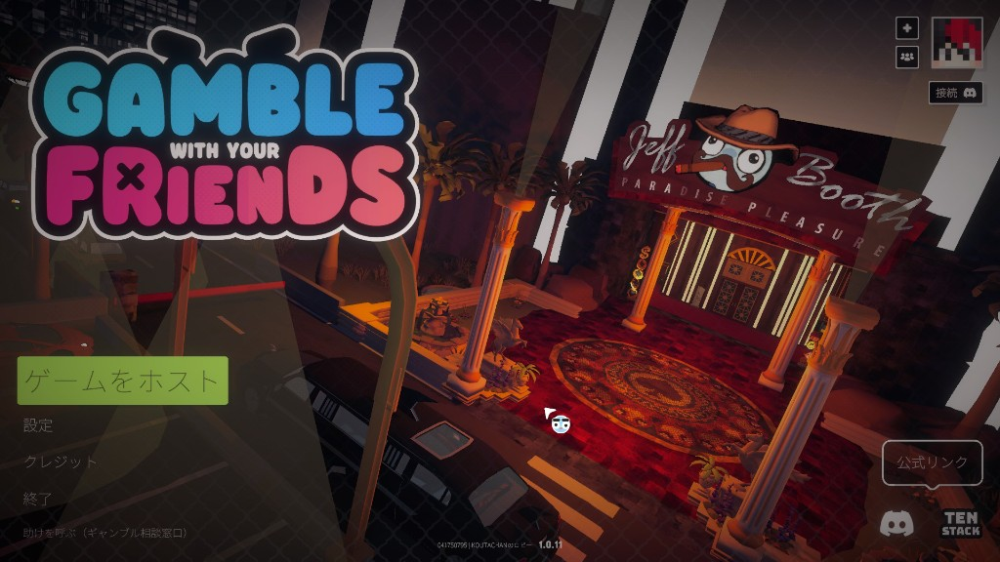

# GwyfJpn

[Gamble With Your Friends](https://store.steampowered.com/app/3892270/Gamble_With_Your_Friends/)（Steam）向けの日本語化 BepInEx プラグインです。ゲーム本体を改変せず、実行時に UI テキストを置換します。

## 対応バージョン（MOD バージョン v0.1.0 現在）

- ゲームバージョン **1.0.11** で動作確認
- BepInEx 5

## 機能

- メインメニュー、設定、ロビー、ゲーム内 UI の日本語表示
- TextMeshPro（`TMP_Text`）の表示文字列を Harmony でフックして置換
- 未翻訳文字列を `runtime_unknown.jsonl` に記録

## 翻訳状況

| 項目 | 推定カバレージ |
|------|----------------|
| **全体** | **約 85%** |
| メインメニュー | 約 100% |
| 設定 | 約 100% |
| リザルト画面（日終わり統計） | 約 90% |
| カジノゲーム UI | 約 70% |
| アイテム・ショップ | 約 100% |

翻訳エントリ数は約 **1,500 件**。プレイ体験ベースの推定値です。

完全な翻訳ではありません。英語が残る場合は [Issue](https://github.com/KoutaChan/Gwyf-JPN/issues) または `runtime_unknown.jsonl` の共有をお願いします。

## 導入方法

1. [Releases](https://github.com/KoutaChan/Gwyf-JPN/releases/latest) から最新の zip をダウンロードする
2. [BepInEx 5](https://github.com/bepinex/bepinex/releases) の `BepInEx_win_x64_*.zip` をゲームフォルダに展開する（未導入の場合）
3. **Steam から一度起動**し、`BepInEx/plugins/` フォルダができることを確認する
4. [Releases](https://github.com/KoutaChan/Gwyf-JPN/releases/latest) の zip を展開し、中身を **`BepInEx/plugins/`** に入れる
5. 再度 Steam から起動して動作確認する

> [!IMPORTANT]
> ゲームは **Steam 経由で起動**してください。exe 直起動だと SteamAPI 初期化に失敗することがあります。

詳細は [docs/user/install.md](docs/user/install.md) を参照してください。

## ライセンス・クレジット

- ゲーム [Gamble With Your Friends](https://store.steampowered.com/app/3892270/) © TEAM GWYF / TENSTACK
- NotoSansJP([SIL OPEN FONT LICENSE Version 1.1](fonts/OFL.txt))
